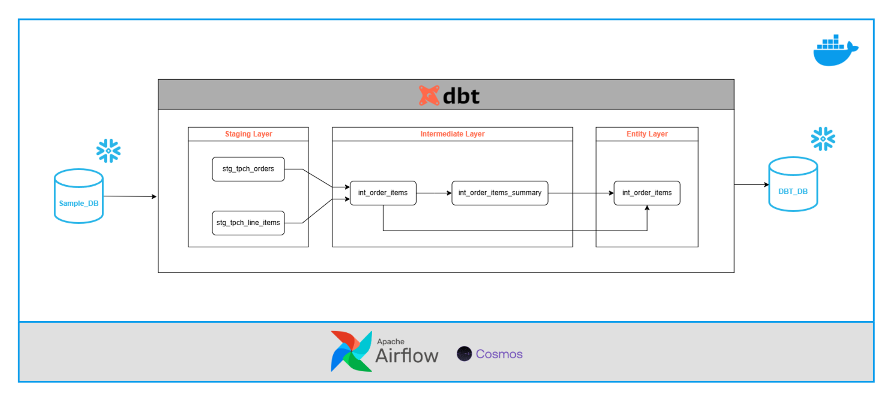

Overview
========

This project is a recreation of [jayzern's](https://www.youtube.com/@jayzern) data pipeline that takes a sample dataset from snowflake, transforms it with DBT, is orchestrated using Airflow via Cosmos, and is containerized with Docker.

System Architecture
===================


## Pre-requisites
1. Snowflake account
2. GitHub account
3. IDE with git integration
4. Docker Desktop
5. Packages:
    - dbt-snowflake
    - dbt-core
    - astronomer-cosmos

Data Sources and Destinations
=============================

* Raw data is extracted from Snowflake's SNOWFLAKE_SAMPLE_DATA database, under its TPCH_SF1 schema, using tables OREDERS and LINEITEMS.
* The Snowflake enviroment that the data will be loaded on to was created using the SQL query below:
```
use role accountadmin;

create warehouse if not exists dbt_wh with warehouse_size='x-small';
create database if not exists dbt_db;
create role if not exists dbt_role;

show grants on warehouse dbt_wh;

grant usage on warehouse dbt_wh to role dbt_role;
grant role dbt_role to user danariola83;
grant all on database dbt_db to role dbt_role;

use role dbt_role;

create schema if not exists dbt_db.dbt_schema;
```
* This project uses both singular and generic data tests including:
    -   uniqueness and absence of null values
    -   referential integrity
    -   accepted values
    -   values falling within a specified date range


Project Contents
================

The project contains the following files and folders:

- dags: This folder contains the Python files for your Airflow DAGs. By default, this directory includes one example DAG:
    - `dbt_dag.py`: Python file used to configure and run Airflow DAG
    - dbt: This folder contains the main dbt directory (i.e. dbt_test5) with all the models, tests, macros, and dbt_project.yml file.
- Dockerfile: This file contains a versioned Astro Runtime Docker image that provides a differentiated Airflow experience. If you want to execute other commands or overrides at runtime, specify them here.
- include: This folder contains any additional files that you want to include as part of your project. It is empty by default.
- packages.txt: Install OS-level packages needed for your project by adding them to this file. It is empty by default.
- requirements.txt: Install Python packages needed for your project by adding them to this file. It is empty by default.
- plugins: Add custom or community plugins for your project to this file. It is empty by default.
- airflow_settings.yaml: Use this local-only file to specify Airflow Connections, Variables, and Pools instead of entering them in the Airflow UI as you develop DAGs in this project.

Deploying the Project Locally
===========================

1. Start Airflow on your local machine by running 'astro dev start'.

This command will spin up 4 Docker containers on your machine, each for a different Airflow component:

- Postgres: Airflow's Metadata Database
- Webserver: The Airflow component responsible for rendering the Airflow UI
- Scheduler: The Airflow component responsible for monitoring and triggering tasks
- Triggerer: The Airflow component responsible for triggering deferred tasks

2. Verify that all 4 Docker containers were created by running 'docker ps'.

Note: Running 'astro dev start' will start your project with the Airflow Webserver exposed at port 8080 and Postgres exposed at port 5432. If you already have either of those ports allocated, you can either [stop your existing Docker containers or change the port](https://www.astronomer.io/docs/astro/cli/troubleshoot-locally#ports-are-not-available-for-my-local-airflow-webserver).

3. Access the Airflow UI for your local Airflow project. To do so, go to http://localhost:8080/ and log in with 'admin' for both your Username and Password.

You should also be able to access your Postgres Database at 'localhost:5432/postgres'.

Deploy Your Project to Astronomer
=================================

If you have an Astronomer account, pushing code to a Deployment on Astronomer is simple. For deploying instructions, refer to Astronomer documentation: https://www.astronomer.io/docs/astro/deploy-code/

Contact
=======

The Astronomer CLI is maintained with love by the Astronomer team. To report a bug or suggest a change, reach out to our support.
